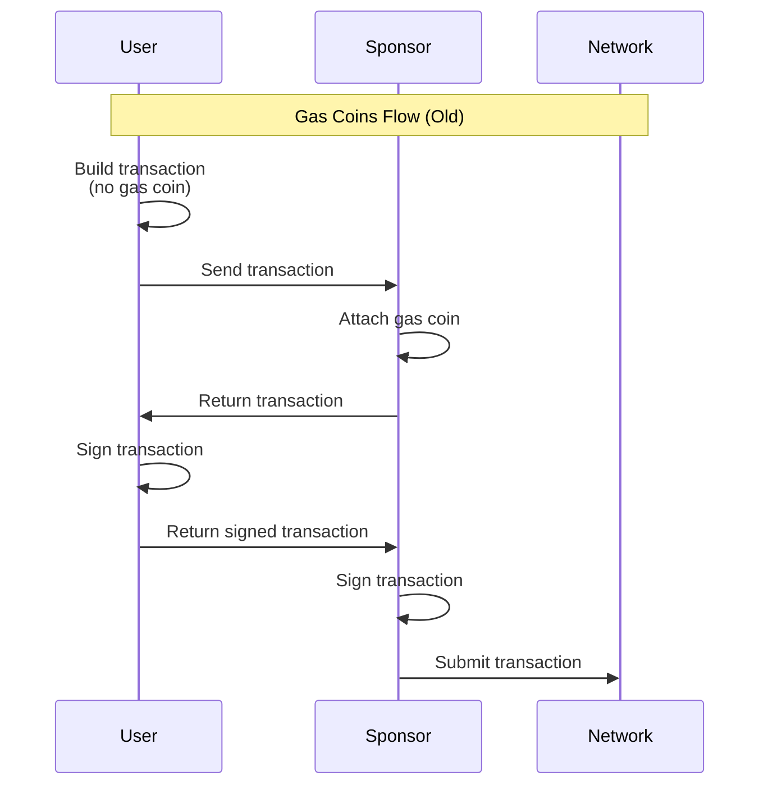
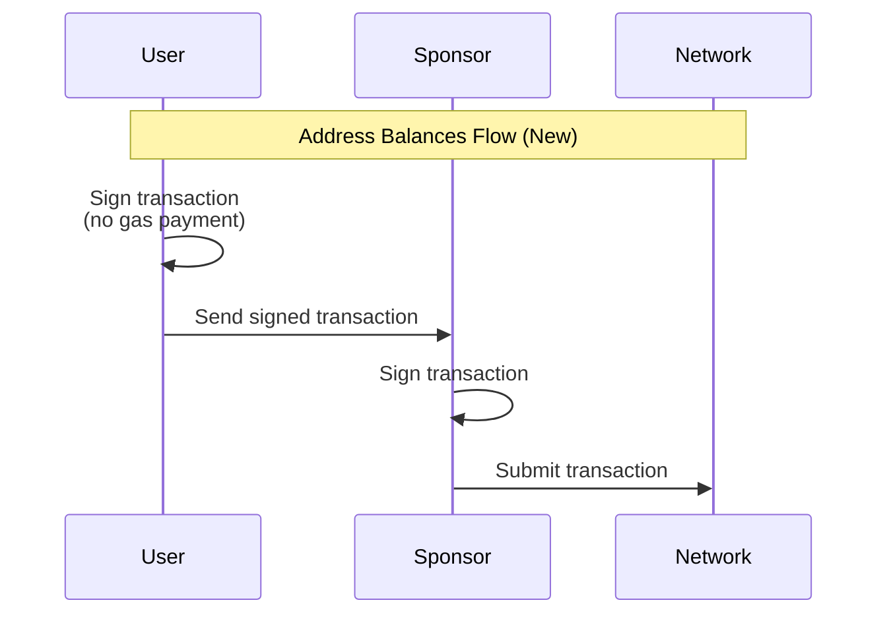

|   SIP-Number | 58 |
|         ---: | :--- |
|        Title | Sui Address Balances |
|  Description | Address-based balances for fungible assets, as a replacement for Coin objects |
|       Author | Mark Logan |
|       Editor | <Leave this blank; it will be assigned by a SIP Editor> |
|         Type | Standard |
|     Category | Core, Framework |
|      Created | 2025-12-05
| Comments-URI | <Leave this blank; it will be assigned by a SIP Editor> |
|       Status | <Leave this blank; it will be assigned by a SIP Editor> |
|     Requires | <Optional; SIP number(s), comma separated> |

## Abstract

Sui Address Balances provide a canonical balance for each `(SuiAddress, Balance<T>)` pair.
This simplifies management of fungible assets, which currently behave more like a UTXO system in Sui, and require indexing, coin-selection logic, smashing, and so on.
Sui will retain its existing object-centric model for all non-fungible assets (NFTs, Capabilities, DeFi pools, etc).
Crucially, while this system may appear similar to the native functionality of account-based L1s, it does not rely on any account-based locking, and hence offers unlimited parallelism of both deposits and withdrawals.


## Motivation

Currently, all fungible assets (principally currencies built with Sui's `Coin<T>` system) can only live inside of objects, typically `Coin<T>` objects.
This system has most of the same benefits and drawbacks of UTXO-based systems:

Benefits:
- Ability to execute transactions in parallel if they do not have common inputs.
- Ability to write many deposits to an account in parallel.

Drawbacks:
- Complex indexing required to determine the total amount of currency owned by a given address.
- Client-side coin selection logic.
- Multiple parallel clients using the same address must synchronize somehow in order to avoid equivocation.
- Transaction construction is inherently stateful: Clients must know the latest state of all owned objects (including the gas coin) in order to build a valid transaction.

The address balances system solves all of these drawbacks without giving up any of the benefits.
It permits:
- Parallelism for both deposits and withdrawals without account-based locking.
- Automatic merging of all deposits to an address into a single canonical balance owned by that address.
- Payment of gas from an address's SUI balance. (This permits stateless transaction construction.)

However there are a few small risks/drawbacks to mention:
- Some users or clients may get confused by the fact that funds can be stored among zero or more coins **and** an address balance as well.
- During the transition period, there may be some confusion about the best way to transfer funds, or the best way to design contracts.

## Specification

Sui address balances are built using the following components:
- The "accumulator" system which supports parallel deposits and withdrawals.
- Extensions to the Transaction format, and a Move API which allow deposits and withdrawals.
- A backward compatibility layer for supporting old dApps which do not understand address balances.

### Accumulator System

Accumulators are a new concept in Sui which allows the construction of a scalable Address Balance system.
The accumulator system allows values of some type `T` to be associated with a `(SuiAddress, T)` tuple.
The given `SuiAddress` may be a wallet address or an object ID.
A given `(SuiAddress, T): Value` record is called an accumulator.
Accumulators are stored as dynamic fields under the root accumulator object (id `0xacc`).

Values of type `T` must be "mergeable" and/or "splittable" via some commutative operation (such as addition/subtraction).
Transactions may either merge (deposit) or split (withdraw) from an accumulator.
This is done by emitting "accumulator events" rather than writing to objects.
(Accumulator events are distinct from ordinary Sui Events emitted via the `0x2::event::emit()` function).
During checkpoint construction, all accumulator events emitted by the transactions in the checkpoint are merged together, and one or more settlement transactions are created.
Settlement transactions are system transactions which update the values of each accumulator written to by the transactions in the checkpoint.

The Address Balance system is built on the accumulator system, with the following additional properties:
- Any transaction can merge (deposit) to any accumulator.
- Only the owner of an accumulator can split (withdraw) from it.
- `T` must be a type of the form `0x2::balance::Balance<S>`, that is, only standard currencies can be sent using address balances.

The accumulator system is not currently extensible by user code, but it may be in the future if there are compelling use cases for this.

### Transaction Format

Transactions gain a new type of `CallArg` called `CallArg::FundsWithdrawal` which expresses an attempted reservation from an address balance.
`CallArg::FundsWithdrawal` specifies the amount of the reservation, the type of currency being reserved, and the owner of the funds (typically the transaction sender).

At execution time, all `CallArg::FundsWithdrawal` inputs are converted into `0x2::funds_accumulator::Withdrawal<T>` objects.
These objects behave similarly to `0x2::balance::Balance<T>` in that they have `split` and `join` operations.
They can be converted into `0x2::balance::Balance<T>` via the `redeem()` method.
Withdrawals are not actually considered to have been withdrawn unless redeemed.
In other words, if you create a `Withdrawal<T>` but do not `redeem()` it, your balance will not change.

The purpose of the reservation system is two-fold:
- It allows signers of transactions to easily verify the maximum amount of outflows from their account before signing a transaction.
- It allows the scheduler to avoid scheduling a transaction or set of transactions that could cause underflow of any account. Because the scheduler guarantees that underflow cannot occur, the system does not require any account-level locking at execution time for safety. This results in unlimited parallelism for withdrawals.

### Move API

The Move API consists of the following three functions:

```move
/// Send a `Balance` to an address's funds accumulator.
public fun send_funds<T>(balance: Balance<T>, recipient: address) {
    sui::funds_accumulator::add_impl(balance, recipient);
}

/// Redeem a `Withdrawal<Balance<T>>` to get the underlying `Balance<T>` from an address's funds
/// accumulator.
public fun redeem_funds<T>(withdrawal: sui::funds_accumulator::Withdrawal<Balance<T>>): Balance<T> {
    withdrawal.redeem()
}

/// Create a `Withdrawal<Balance<T>>` from an object to withdraw funds from it.
public fun withdraw_funds_from_object<T>(
    obj: &mut UID,
    value: u64,
): Withdrawal<Balance<T>> {
    sui::funds_accumulator::withdraw_from_object(obj, value as u256)
}
```

`send_funds` should be self-explanatory.

`redeem_funds<T>(Withdrawal<Balance<T>>): Balance<T>` - this is the method by which withdrawals are turned into balances. There are two ways to obtain a withdrawal:

1. Pass a `FundsWithdrawal` as a transaction input. 
2. Call `withdraw_funds_from_object` - more on this below.

When `redeem_funds()` is called, an accumulator event is emitted which marks the funds as withdrawn. This withdrawal is _settled_ by the next settlement transaction.

### Object withdrawals.

Address balances can be owned either by wallets (i.e. addresses that correspond to public keys or some other Sui authenticator) or `UID`s.

When funds are owned by a `UID`, they can only be withdrawn using `withdraw_funds_from_object`, and do not require a `FundsWithdrawal` transaction input.
This allows various forms of account abstraction and "till" patterns which formerly depended on Transfer-to-object to be used with address balances.
Because `withdraw_funds_from_object` takes a `&mut UID` argument, object-owned balances cannot be withdrawn from in parallel.

## Gas and Stateless Transaction Construction

Rather than requiring a coin object to pay gas, Address Balances allow clients to pay for their gas from the sender or sponsor's `SUI` balance.
This is done by leaving the `gas_data.payment` vector empty.
The remaining fields in `gas_data` (particularly `budget`) are sufficient to construct an implicit `FundsWithdrawal` representing the gas payment.
This withdrawal is treated exactly the same as any other withdrawal by the scheduler.
After execution, a withdrawal event is emitted to cover the gas cost of the transaction.

Prior to this feature, Sui transactions necessarily had at least one owned object: the gas coin.
This requires clients to have an up to date ObjectRef for their gas coin.
Building a transaction using a stale ObjectRef results in errors.
Clients attempting to submit concurrently-executing transactions must manage a pool of objects, and errors in this process can result in objects remaining locked until the end of the epoch.

Gas payment from address balances frees clients from this constraint, and allows "stateless" transaction construction - which is to say, they can construct valid transactions without knowing the exact state of any objects.

Because gas payments from a SUI Address Balance function as `FundsWithdrawal` inputs, they also allow concurrent transaction execution.
Clients no longer need to manage a pool of gas objects in order to send concurrently executing transactions.
(Note: if the transaction involves owned objects besides the gas object, such as capability objects, we recommend the use of [Party Objects](https://docs.sui.io/guides/developer/objects/object-ownership/party) in order to avoid statefulness).

### Replay prevention

The presence of any owned object in a transaction offers durable replay protection.
This is because a given owned object version cannot be consumed by more than one transaction.
Owned objects also give cross-chain replay prevention, since it is impossible for any `ObjectRef` to be valid on two different networks.
Without the presence of an owned object, transactions on Sui would be replayable over time, and across networks, a serious issue for safety and security.

Replay prevention for stateless transactions is achieved as follows:

1. Validators remember the digests of all transactions executed in the current and prior epoch.
2. Stateless transactions specify a 2-epoch window of validity. That is, they must declare that they are valid only in epoch N and N+1.
3. Stateless transactions must specify the network on which they are valid.

With these three constraints, validators can reject any valid transaction that has already been executed.
If the current epoch is not within the transactions validity window, then the transaction can be considered invalid and rejected immediately.

The above is achieved via [TransactionExpiration::ValidDuring](https://github.com/MystenLabs/sui/blob/4708a2b395fbe3446a360910f863efcbbc08e27f/crates/sui-types/src/transaction.rs#L1888).
Note that `ValidDuring` also includes a nonce field, which can be varied by a client that wishes to send an otherwise identical transaction (for instance, a counter increment) multiple times.
The `nonce` should not be confused with EVM nonces - the value may be anything, and is entirely ignored by the protocol except when computing the digest of a transaction.

### Gas sponsorship & public gas stations

With gas coins, sponsorship usually requires a flow like the following:

1. User builds transaction, leaves gas payment empty, and sets `gas_data.owner` to the sponsor address.
2. User sends transaction to the sponsor.
3. Sponsor attaches gas coin, returns transaction to user.
4. User signs the now-complete transaction and returns it to the sponsor.
5. Sponsor signs the transaction.
6. Sponsor either submits the transaction to the network, or returns it to the user for submission.




With address balances gas payments, the flow is simplified to:
1. User signs transaction, leaves gas payment empty, and sets `gas_data.owner` to the sponsor address.
2. User sends transaction to the sponsor.
3. Sponsor signs the transaction.
4. Sponsor either submits the transaction to the network, or returns it to the user for submission.



Not only does this eliminate round trips from the process, it also protects the sponsor from the risk of having its gas coins locked by equivocating users.
This opens the possibility of public gas stations (as opposed to the permissioned services that typically do sponsorship today), as follows:

1. User constructs a sponsored transaction as described above, but also includes a transfer of `USDC` or some other asset to the sponsor's address as one of the commands.
2. Sponsor can now sign and execute the transaction in order to receive the offered payment.

_There are many issues around gas stations which are beyond the scope of this SIP.
For instance, the sponsor should dry run the transaction to estimate gas cost and check for aborts.
Usage of this system by defi applications (which have unpredictable aborts) may also require PTB fallibility regions so that the sponsor can receive the payment even if the rest of the transaction aborts._

## RPC

RPC systems, including gRPC, GraphQL, and JSON-RPC, will be extended to include methods for reading the current state of Address Balances.
The exact API definitions are TBD, but they should be conceptually quite close to the following:

- `get_balance(type, address) -> u64`
- `get_balance_types(address) -> [type]`
- `get_balances_for_address(address) -> [(type, u64)]`

## Indexing

Indexers that wish to track address balance information will have two options:

1. If they only need to track balances, they should process all settlement transactions, and read the balances and owners of all balance accumulators updated by the settlement transactions. Settlement transactions can be identified by the fact that they take the root accumulator object (id `0xacc`) as a mutable input.

2. If they need to track all deposit and withdraw activity, then they must process every transaction, and index all accumulator events. Accumulator events can be obtained from effects by calling `TransactionEffectsAPI::accumulator_events()`.

## Backwards Compatibility

Address balances have two forms of backward compatibility with existing systems.

### PTB / Contract compatibility

Address Balances provide a way to store funds on Sui without using `Coin<T>`, but pre-existing contracts use `Coin<T>` and `&mut Coin<T>` extensively in their public APIs.
This gap can be bridged via additional PTB commands that create an ephemeral `Coin<T>` object from each `Withdrawal<T>`.
The resulting coin can be passed to any Move call expecting `Coin<T>` or `&mut Coin<T>`.

SDKs and other code that constructs transactions could do this for users.
But instead, this compatibility layer will be handled automatically at execution time.
That is, a transaction can pass a `Withdrawal<T>` to any parameter expecting `Coin<T>` or `&mut Coin<T>`, the conversion will be done via an automatically inserted call to `0x2::coin::redeem_funds()` call.

At the end of the transaction, the ephemeral coin object may still be alive, if it was not passed by value during the PTB.
Any such coins will be transferred back to the originating Address Balance at the end of the transaction.

### JSON-RPC backward compatibility

There may be existing dApps and wallets that cannot or will not upgrade to recent versions of the SDK, and hence may lack awareness of Address Balances.
To such clients, funds held in Address Balances will be invisible.

In order to prevent breaking old clients, we will add a backward compatibility layer to the jsonrpc API.
This layer will present a "fake" coin to the client which appears to hold the Address Balance funds for each currency type.
This fake coin will be interpreted by validators as a `FundsWithdrawal` arg, allowing old clients to spend funds held within address balances.

## Test Cases

Most tests so far can be found in https://github.com/MystenLabs/sui/blob/main/crates/sui-e2e-tests/tests/address_balance_tests.rs

There will also be randomized-workload tests added.

## Copyright

Copyright (c) Mysten Labs, Inc.